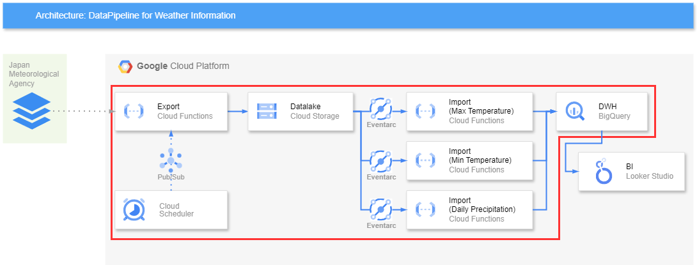

# DatapiplineJMA

## ＜概要＞

[気象庁の気象情報](https://www.data.jma.go.jp/stats/data/mdrr/index.html)を取得し、加工した上でBigQueryに登録するデータパイプラインです。  
上記の構成図の内、赤枠内のサービスをTerraformにて定義しています。

このデータパイプライン構築にあたって得られた知見や工夫等書いた記事を公開しています！
https://qiita.com/Yuno_nekoisland/items/80208c3dc4d3b71c98bc
